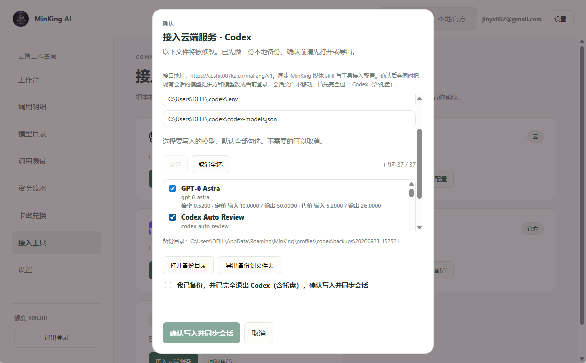
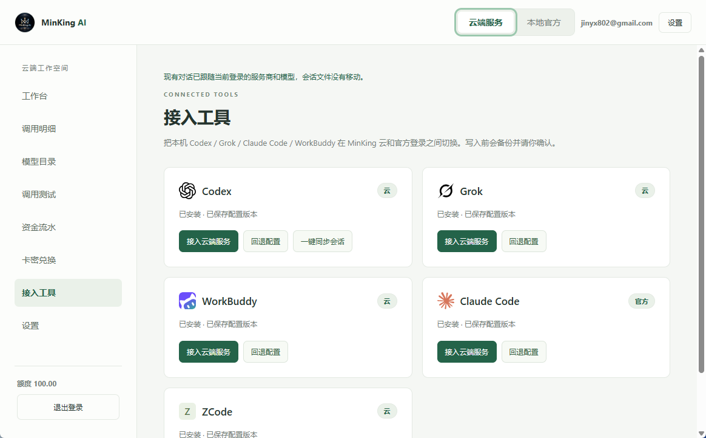

# MinKing AI

主打三件事：一键配置、会话续连、本地中转。

Windows 托盘程序把本机的 Codex、Grok、WorkBuddy、Claude Code、ZCode 接到 MinKing 云，也可以在本机把已经登录的官方账号转成 OpenAI 兼容接口。当前桌面端 `0.2.17`，网关 `0.8.27`。

## 一键配置

在「接入工具」里选择要写入的模型，确认后写入本机配置。写入前自动做一份本地备份，并列出将要修改的文件。回到官方登录时可以选择以前的备份版本。官方 `auth.json`、Cookie 和 token 不会上传。

| 工具 | 云端写入 |
| --- | --- |
| Codex | `~/.codex/config.toml` 里的 MinKing 供应商。已有的其它配置会保留 |
| Grok | `%USERPROFILE%\.grok\config.toml` |
| WorkBuddy / CodeBuddy | `models.json` 中追加 MinKing 模型 |
| Claude Code | `ANTHROPIC_API_KEY` 和 `ANTHROPIC_BASE_URL` |
| ZCode | `provider_config.json`，每个模型一条供应商 |



桌面登录态用 Windows DPAPI 保护。关闭窗口后程序留在托盘，从托盘选择退出才会结束。

## 会话续连

Codex 已有对话留在原来的会话文件里。接入或更换模型后，点「一键同步会话」，只把这些对话的服务商和模型改成当前路由，不另建一份对话，也不移动会话文件。

云端网关把历史请求交给 Codex 时，会去掉只属于上一次登录的条目 id，保留 `call_id` 和可见内容。同一条对话在换账号或换路由之后可以接着用。



## 本地中转

顶部切换到「本地官方」后，本机启动一个只监听 `127.0.0.1:18787` 的 OpenAI 兼容服务。调用方使用 `平台/官方模型ID`，例如 `grok/grok-4.6`。请求由这台电脑上已经登录的官方账号完成，不经过 MinKing 云。

本地 API Key 只校验对本机服务的访问，不会发给官方。官方凭据只读，不主动刷新，也不会上传。模型目录和文本接口覆盖 Codex、Grok、WorkBuddy、Claude、Antigravity。图片和视频按各平台现有能力接入。

从窗口复制 Base URL 和 Key 即可。本地接入不覆盖正在使用的官方配置。

```toml
model_provider = "minking_local"
model = "grok/grok-4.6"

[model_providers.minking_local]
name = "MinKing Local"
base_url = "http://127.0.0.1:18787/v1"
wire_api = "responses"
env_key = "MINKING_LOCAL_API_KEY"
```

## 云端网关

同一把 API Key 可以调用 Codex、Grok、Antigravity 和 WorkBuddy。公网示例入口是 `https://ceshi.007ka.cn/maliang/v1`。

| 部分 | 位置 | 作用 |
| --- | --- | --- |
| 网关 | `app/`，`python -m app` | `/v1/*`，默认端口 `8787` |
| 官网 | `/` | 产品介绍、模型说明、客户端下载 |
| 管理台 | `/admin` | 上游账号、API Key、计费、卡密、调用明细 |
| 用户门户 | `/portal`，公网反代下也挂在 `/v1/portal` | 余额、试玩、流水、卡密、工具接入 |
| 桌面端 | `clients/minking-desktop` | `MinKingAI.exe` |

客户端接口包括 `GET /v1/models`、`POST /v1/responses`、`POST /v1/chat/completions`、`POST /v1/messages`、图片、视频，以及 `/mcp` 上的 `generate_image` 和 `edit_image`。Anthropic 的 `ANTHROPIC_BASE_URL` 不要带末尾 `/v1`。

```http
Authorization: Bearer sk-ts-...
```

每把 Key 有一个美元钱包。售价是官方目录价乘以倍率。未定价的模型不会出现在客户端目录里。余额为 0 时，生成请求返回 `402`。加款必须大于 0，且不超过 10000 美元。

日志和数据库不保存提示词、回复、图片、完整 API Key、Session ID、Cookie、密码或 `auth.json` 内容。

管理台用会话登录，用户名固定为 `admin`。旧的 `X-Admin-Token` 已停用。门户和桌面端使用同一批账号。网页上的工具接入会打开桌面端，不直接改本机配置。

## 本地运行

需要 Python 3.11 或更高版本。

```powershell
python -m venv .venv
.\.venv\Scripts\Activate.ps1
pip install -e ".[dev]"
copy .env.example .env
python -m app
```

启动前在 `.env` 里把 `ADMIN_INITIAL_PASSWORD` 设成至少 12 位的随机密码。打开 `http://127.0.0.1:8787/admin`，用 `admin` 和这个密码登录。登录成功后从 `.env` 删除 `ADMIN_INITIAL_PASSWORD`。

桌面端：

```powershell
cd clients\minking-desktop
.\run.cmd
```

打包后的程序是 `clients\minking-desktop\dist\MinKingAI.exe`。Windows 需要 WebView2。

```powershell
.\.venv\Scripts\python.exe -m pytest -q --ignore=tests/live
```

`.gitignore` 已排除 `.env`、`.venv/`、`data/`、`output/` 和打包目录。不要把这些文件提交进仓库。
